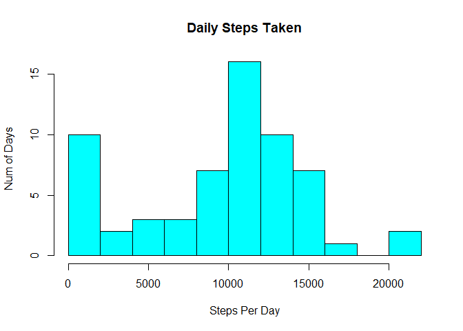

Reading data into an object and checking its content.

    unzip("activity.zip")
    activitydata <- read.csv("activity.csv", header = TRUE)
    head(activitydata)

    ##   steps       date interval
    ## 1    NA 2012-10-01        0
    ## 2    NA 2012-10-01        5
    ## 3    NA 2012-10-01       10
    ## 4    NA 2012-10-01       15
    ## 5    NA 2012-10-01       20
    ## 6    NA 2012-10-01       25

Total Number of Steps taken per Day. dplyr package will be used for this
purpose.

    library(dplyr)
    stepsDaily <- activitydata %>% group_by(date) %>% summarise(stepsPerDay = sum(steps, na.rm = TRUE))

    ## `summarise()` ungrouping output (override with `.groups` argument)

Plotting the Histogram

    hist(stepsDaily$stepsPerDay, breaks = 15, xlab = "Steps Per Day", ylab = "Num of Days", main = "Daily Steps Taken", col = 5)

Estimating the mean and median

    statsStepsPerDay <- stepsDaily %>% summarise(Mean = mean(stepsPerDay, na.rm = TRUE), Median = median(stepsPerDay, na.rm = TRUE))
    statsStepsPerDay

    ## # A tibble: 1 x 2
    ##    Mean Median
    ##   <dbl>  <int>
    ## 1 9354.  10395

Plotting the interval data, for which ggplot2 library functions are
being used

    library(ggplot2)
    intervalData <- activitydata %>% group_by(interval) %>% summarise(AverageSteps = mean(steps,na.rm = TRUE))

    ## `summarise()` ungrouping output (override with `.groups` argument)

    with(intervalData, qplot(interval, AverageSteps, geom = "line", main = "Average Steps in a 5-min Interval"))

Maximum daily steps taken:

    intervalData[which.max(intervalData$AverageSteps),]

    ## # A tibble: 1 x 2
    ##   interval AverageSteps
    ##      <int>        <dbl>
    ## 1      835         206.

Imputing the data…

    activitydata_noNA <- activitydata[which(!is.na(activitydata$steps)),]
    interval_only <- activitydata_noNA %>% group_by(interval) %>% summarise(average=mean(steps))

    ## `summarise()` ungrouping output (override with `.groups` argument)

    interval_only$average <- as.integer(interval_only$average)
    activitydata_na <- activitydata[which(is.na(activitydata$steps)),]
    activitydata_na$steps <- ifelse(activitydata_na$interval==interval_only$interval,interval_only$average)
    activitydata_clean <- rbind(activitydata_noNA,activitydata_na)

Number of rows earlier which had NA values:

    nrow(activitydata_na)

    ## [1] 2304

Assigning some new columns for weekdays and weekends

    activitydata_clean$date <- as.Date(activitydata_clean$date)
    activitydata_clean$DayOfWeek <- weekdays(activitydata_clean$date)
    activitydata_clean$TypeOfDay <- ifelse(activitydata_clean$DayOfWeek == "Saturday" | activitydata_clean$DayOfWeek == "Sunday", "Weekend", "Weekday")

Plotting the histogram for daily steps taken when NA data is taken care
of

    stepsDaily_clean <- activitydata_clean %>% group_by(date) %>% summarise(stepsPerDay = sum(steps, na.rm = TRUE))

    ## `summarise()` ungrouping output (override with `.groups` argument)

    hist(stepsDaily_clean$stepsPerDay, breaks = 15, xlab = "Steps Per Day", ylab = "Num of Days", main = "Daily Steps Taken after NAs are removed", col = 5)

 New
mean and Median values after NA data is taken care of:

    statsStepsPerDay_clean <- stepsDaily_clean %>% summarise(Mean = mean(stepsPerDay, na.rm = TRUE), Median = median(stepsPerDay, na.rm = TRUE))
    statsStepsPerDay_clean

    ## # A tibble: 1 x 2
    ##     Mean Median
    ##    <dbl>  <int>
    ## 1 10750.  10641

Comparing the 5-min interval data for weekends and weekdays: Is there a
trend? The trend is almost similar on weekdays and weekends, but
generally, we see that weekdayshave higher count of total steps taken
for any interval.

    intervalData_clean <- activitydata_clean %>% group_by(interval, TypeOfDay) %>% summarise(AverageSteps = mean(steps,na.rm = TRUE))

    ## `summarise()` regrouping output by 'interval' (override with `.groups` argument)

    with(intervalData_clean, qplot(interval, AverageSteps, geom = "line", facets = TypeOfDay~., color = TypeOfDay, main = "Average Steps in a 5-min Interval"))

